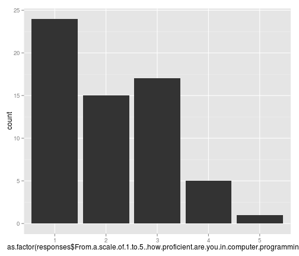
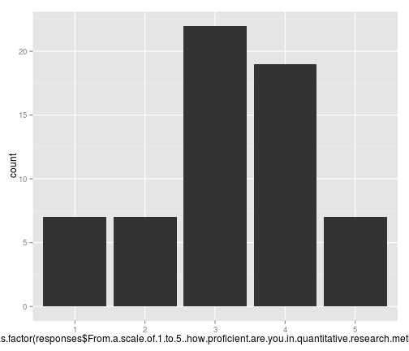
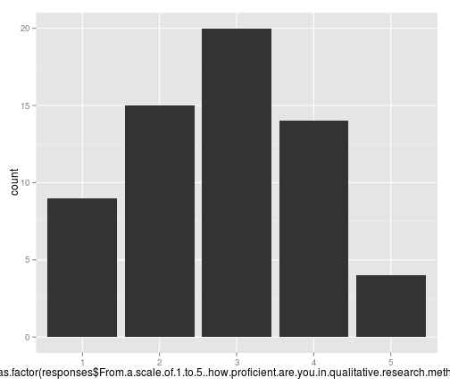

HI!
========================================================


```r
# load data
responses <- read.delim("~/Desktop/CSAPH Modelling Workshop (Responses) - Form Responses.tsv", 
    dec = ",")

drops <- c("Which.certificate.program.are.you.pursuing.1", "X")

responses <- responses[, !(names(responses) %in% drops)]

require(plyr)
```

```
## Loading required package: plyr
```

```r
responses$d1 <- 0
responses$d2 <- 0
responses$d3 <- 0
responses$d1[grep("Feb 26th", responses$RSVP.for.a.workshop.session)] <- 1
responses$d2[grep("Mar 1st", responses$RSVP.for.a.workshop.session)] <- 1
responses$d3[grep("Mar 5th", responses$RSVP.for.a.workshop.session)] <- 1

require(ggplot2)
```

```
## Loading required package: ggplot2
```

```r
require(reshape2)
```

```
## Loading required package: reshape2
```

```r

responses2 <- melt(responses, measure.vars = c("d1", "d2", "d3"))
# Plot using colour as an aesthetic to distinguish lines
signed.up <- ggplot(responses2, aes(x = as.factor(value), fill = variable)) + 
    geom_bar(position = "dodge")
```


```r
signed.up
```

 

# Self-rated programming proficiency

```r
programming <- ggplot(responses, aes(x = as.factor(responses$From.a.scale.of.1.to.5..how.proficient.are.you.in.computer.programming.))) + 
    geom_bar(stat = "bin")
programming
```

 


# Self-rated quant research proficiency

```r
quant <- ggplot(responses, aes(x = as.factor(responses$From.a.scale.of.1.to.5..how.proficient.are.you.in.quantitative.research.methods.))) + 
    geom_bar(stat = "bin")
quant
```

 


# Self-rated qual research proficiency

```r
qual <- ggplot(responses, aes(x = as.factor(responses$From.a.scale.of.1.to.5..how.proficient.are.you.in.qualitative.research.methods.))) + 
    geom_bar(stat = "bin")
qual
```

 

